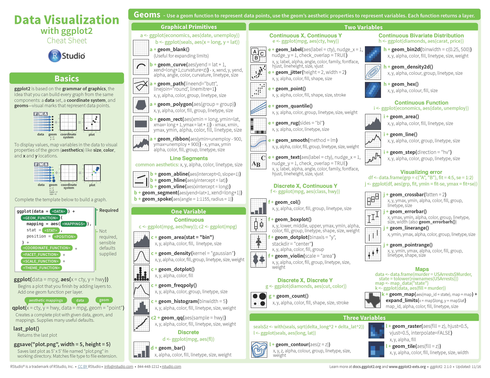
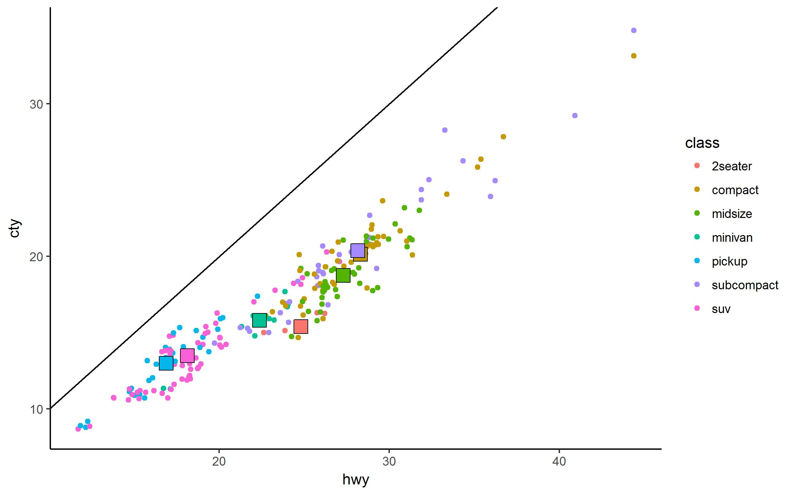
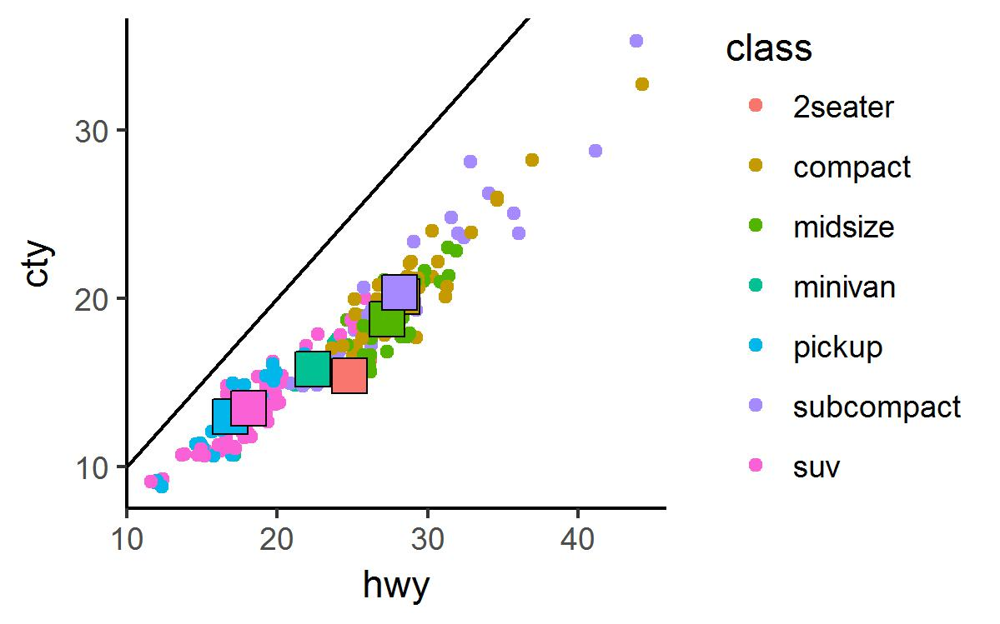
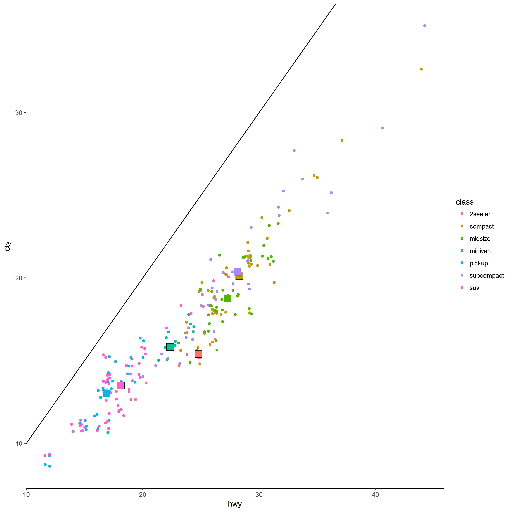
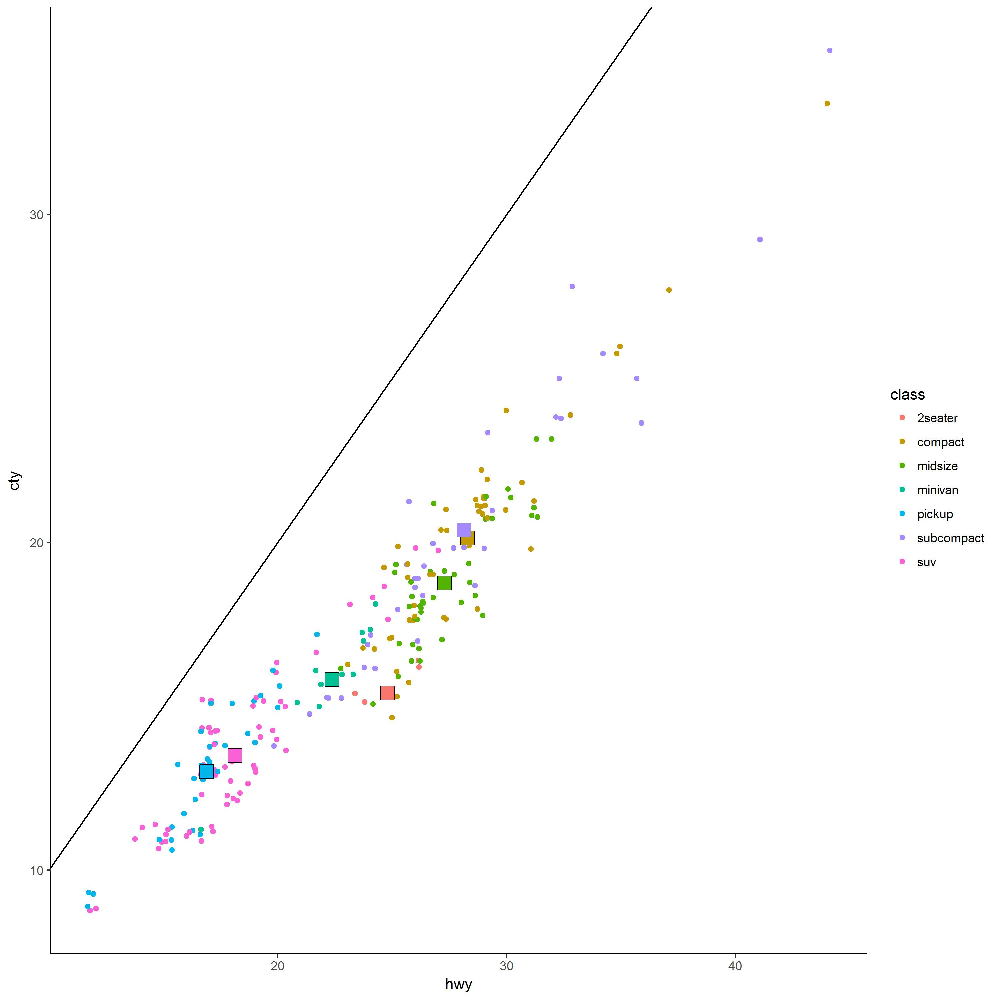
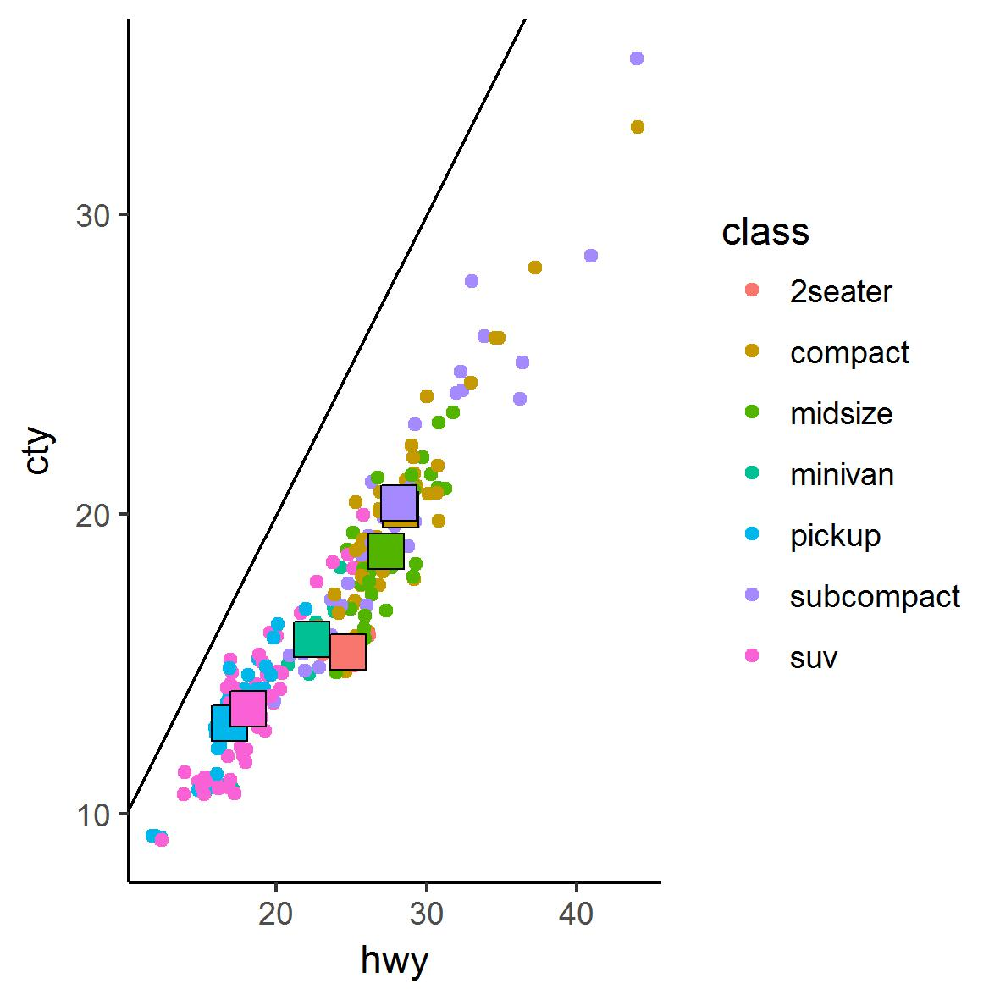

```{r global_options, include=FALSE, warning=FALSE}
options(width = 120)
knitr::opts_chunk$set(tidy.opts=list(width.cutoff=120),width=120,tidy=TRUE)
```

```{r, echo=FALSE,include=FALSE}
library(tidyverse)
```

## SECTION 1 - The Basics
## Installing R

If you don't have them already installed you need to download and install R and R studio  

- Download R
    - <https://cran.r-project.org/>  
- R Studio
    - <https://www.rstudio.com/products/rstudio/download/>


## Introduction to R


- R is an open source programming environment
- It is most commonly used for statistical computing and graphics
- The basic functionality of R can be extended with 'packages'
    - Reusable R functions and their documentation
    - Often times will include sample data. 


## Resources for R

- R for data science <http://r4ds.had.co.nz> 
    - Served as inspiration for a lot of this bootcamp
    - Written by programmers at R Studio
- R Programming for Data Science <https://bookdown.org/rdpeng/rprogdatascience/>
- R Bootcamp <https://www.jaredknowles.com/r-bootcamp/>

## Introduction to R studio  {.scrollable}

- R studio is an IDE within which you can write/edit code, run code, display plots/graphics and a whole host of other functions 


## Getting Started 


- Go to <https://github.com/mseinstein/> to download the Presentions > RBootCamp > r_bootcamp_einstein_2017.R file   
- All the code presented here is within that R file

## What can you do with R {.scrollable}

- Analytics
    + Mathematics, Probability and Statistics
    + Big Data Analytics
    + Statistical Modeling
    + Machine Learning 
- Visualizations
    + Simple but powerful graphics packages
- Applications and Extensions
    + Web applications (Shiny)
    + Bioinformatics/Genomics (Bioconductor)
- Research Friendly
    + Reproducible Results
    + Strong Link to Academia


## Objectives of this Bootcamp {.scrollable}

By the end of this bootcamp, students should be able to  

1. Identify projects and tasks suitable to R
2. Use Rstudio as a frontend for R programming
3. Import data from outside sources into R
4. Manipulate data and perform basic analysis
5. Create and export visualizations of data
6. Modify pre-written R code for their own applications


## Structure of This Bootcamp

1. Visualization of Data
2. Manipulation of Data
3. Importing/cleaning of Data


## Running code in R


- To run any line of code use <kbd>CTRL</kbd>+<kbd>Enter</kbd> or <kbd>Cmd</kbd>+<kbd>Enter</kbd> 
    - R will run the highlighted code OR
    - R will run the line of code which the cursor is on


## Installing and Loading packages

- The power of R can be extended with packages
- You install a package with the `install.packages("Pkg Name")`, e.g., `install.packages("tidyverse")`      
    - Only needs to be done once per machine
    - Tidyverse is a collection of R packages for data manipulation and visualization that are designed to work together
    - This is the main package we will be using 
- To load a package call the `library` function, e.g., `library(tidyverse)`
    - Needs to be loaded every session you want to use it (usually everytime you open R studio)

## Key Symbols

- < - 
    - Assignment operator, e.g. x <- 5
    - The equals sign, =, will work as a substitution in most but not all cases
- `#`
    - Denotes a comment
    - All text following the `#` will be ignored
- `?`function_name 
    - Opens the Documentation for the function
- `??`term
    - Searches the help documentation for the queried string

## Brief Aside 1 {.scrollable}

RXKCD  


```{r, echo=FALSE, message=FALSE, warning=FALSE}
library(RXKCD)
aa <- getXKCD(which="random",saveImg=FALSE,display = FALSE)
knitr::include_graphics(aa$img)
```


## SECTION 2 - Data Visualisations 

## ggplot2
- ggplot2 is a plotting system for R, based on the grammar of graphics
- See http://vita.had.co.nz/papers/layered-grammar.pdf for an in-depth discussion

`library(tidyverse)`

## Data visualization Cheat Sheet {.scrollable}

- R studio provides helpful cheat sheets which you can bring up from the Help toolbar
- Open the Data visualization for ggplot2 cheat sheet




## Graphics in ggplot are built in layers {.scrollable}

Use the data visualization cheatsheet in the RStudio Help menu as a reference

```{r, echo=FALSE}
mpg_class <- mpg %>% group_by(class) %>% summarise(hwy_mean = mean(hwy), cty_mean=mean(cty))
```


```{r, message=FALSE,tidy=FALSE}
ggplot(mpg,aes(x=hwy,y=cty)) + 
  geom_blank()

ggplot(mpg,aes(x=hwy,y=cty)) + 
  geom_blank() +
  geom_abline()

ggplot(mpg,aes(x=hwy,y=cty)) + 
  geom_blank() +
  geom_abline() +
  geom_jitter(aes(color=class))

ggplot(mpg,aes(x=hwy,y=cty)) + 
  geom_blank() +
  geom_abline() +
  geom_jitter(aes(color=class)) +
  geom_point(data=mpg_class,aes(x=hwy_mean,y=cty_mean,fill=class),color="black",size=5,shape=22,show.legend = FALSE) 

```


## mpg dataset {.scrollable}


```{r}
# mpg is a ggplot dataset of fuel economy data from 1999 and 2008 for 38 popular models of car
mpg
summary(mpg) 
mpg$drv
```


## ggplot command {.scrollable}

The ggplot command begins a plot to which you can add layers
```{r, message=FALSE, tidy=FALSE}
ggplot(data = mpg)
ggplot(data = mpg) + 
  geom_point(mapping = aes(x = displ, y = hwy))
ggplot(data = mpg) +
  geom_smooth(mapping = aes(x = displ, y = hwy)) + 
  geom_point(mapping = aes(x = displ, y = hwy))
```

## Variable propagation {.scrollable}

By inserting x and y into ggplot, all layers will use those parameters unless otherwise specified
```{r message=FALSE, tidy=FALSE}
ggplot(data = mpg, mapping = aes(x = displ, y = hwy)) + 
  geom_smooth() + 
  geom_point()

ggplot(data = mpg, mapping = aes(x = displ, y = hwy)) + 
  geom_smooth() + 
  geom_point() +
  geom_smooth(mapping = aes(x = displ,y = cty),color = "red")
```

## Features vs Variables {.scrollable}

Note: if you want to plot a variable to a feature like color or size, it must go in the aes() term, if you just want to set them at a certain value they go outside the aes
```{r message=FALSE, tidy=FALSE} 
ggplot(mpg, aes(displ,hwy)) + 
  geom_smooth(color = "green") + 
  geom_point(aes(color=class),size=2)
```

## Facets {.scrollable}

You can also split the plot into subplots based on a varible using `facet`
```{r, tidy=FALSE}
ggplot(mpg, aes(displ,hwy))  + 
  geom_point() + 
  facet_grid(.~cyl)
ggplot(mpg, aes(displ,hwy))  + 
  geom_point() + 
  facet_grid(cyl~.)
ggplot(mpg, aes(displ,hwy))  + 
  geom_point() + 
  facet_wrap(~cyl)
ggplot(mpg, aes(displ,hwy))  + 
  geom_point() + 
  facet_grid(cyl~class)
```


## Exercises {.scrollable}
Try to make some of the following plots:  
```{r, echo=FALSE, warning=FALSE, message=FALSE, fig.height=2.5}
ggplot(mpg)  + geom_point(aes(displ,hwy,size=class),color="blue",shape=17) 
```

```{r, echo=FALSE, warning=FALSE, message=FALSE, fig.height=2.5}
ggplot(mpg) + 
geom_smooth(aes(displ,hwy, linetype = drv))
```

```{r, echo=FALSE, warning=FALSE, message=FALSE, fig.height=2.5}
ggplot(mpg,aes(displ,hwy,color=drv)) + 
geom_smooth(se=FALSE,show.legend = FALSE) +
geom_point(size=2,show.legend = FALSE)
```


## Graphics and Statistical Transformations {.scrollable}

This time we will be using the `diamonds` dataset

```{r}
diamonds
summary(diamonds)
ggplot(diamonds,aes(cut)) + geom_bar()
ggplot(diamonds,aes(price)) + geom_histogram(bins=100)
```

## Computed Variables {.scrollable} 

- Bar charts, histograms and the other plots in the one variable section of the ggplot2 cheat sheet bin your data based on a single variable 
- You can determine the computed variables of a graphic by using the help function:
    - Computed variables  
        - count  
            * Number of points in bin
        - prop  
            * Groupwise proportion
        
```{r}
ggplot(diamonds) + geom_bar(aes(x=cut,y=..count..,group=1))
ggplot(diamonds) + geom_bar(aes(x=cut,y=..prop..,group=1))
```

## Position adjustments {.scrollable}

```{r}
ggplot(diamonds) + geom_bar(aes(x = color, fill = cut), position = "dodge")
ggplot(diamonds) + geom_bar(aes(x = color, fill = cut), position = "fill")
ggplot(diamonds) + geom_bar(aes(x = color, color = cut), position = "stack",fill=NA)
```


## Example Plots {.scrollable}
plots from <http://r-statistics.co/Top50-Ggplot2-Visualizations-MasterList-R-Code.html>
```{r, warning=FALSE}
ggplot(midwest, aes(x=area, y=poptotal)) + 
  geom_point(aes(col=state, size=popdensity)) + 
  geom_smooth(method="loess", se=F) + xlim(c(0, 0.1)) + ylim(c(0, 500000)) + 
  labs(subtitle="Area Vs Population", y="Population", x="Area", title="Scatterplot", caption = "Source: midwest")


mtcars$`car name` <- rownames(mtcars)  # create new column for car names
mtcars$mpg_z <- round((mtcars$mpg - mean(mtcars$mpg))/sd(mtcars$mpg), 2)  # compute normalized mpg
mtcars$mpg_type <- ifelse(mtcars$mpg_z < 0, "below", "above")  # above / below avg flag
mtcars <- mtcars[order(mtcars$mpg_z), ]  # sort
mtcars$`car name` <- factor(mtcars$`car name`, levels = mtcars$`car name`)  # convert to factor to retain sorted order in plot.

ggplot(mtcars, aes(x=`car name`, y=mpg_z, label=mpg_z)) + 
  geom_bar(stat='identity', aes(fill=mpg_type), width=.5)  +
  scale_fill_manual(name="Mileage", 
                    labels = c("Above Average", "Below Average"), 
                    values = c("above"="#00ba38", "below"="#f8766d")) + 
  labs(subtitle="Normalised mileage from 'mtcars'", title= "Diverging Bars") + 
  coord_flip()


# prep data
df <- read.csv("https://raw.githubusercontent.com/selva86/datasets/master/gdppercap.csv")
colnames(df) <- c("continent", "1952", "1957")
left_label <- paste(df$continent, round(df$`1952`),sep=", ")
right_label <- paste(df$continent, round(df$`1957`),sep=", ")
df$class <- ifelse((df$`1957` - df$`1952`) < 0, "red", "green")

ggplot(df) + geom_segment(aes(x=1, xend=2, y=`1952`, yend=`1957`, col=class), size=.75, show.legend=F) + 
  geom_vline(xintercept=1, linetype="dashed", size=.1) + 
  geom_vline(xintercept=2, linetype="dashed", size=.1) +
  scale_color_manual(labels = c("Up", "Down"), 
                     values = c("green"="#00ba38", "red"="#f8766d")) +  # color of lines
  labs(x="", y="Mean GdpPerCap") +  # Axis labels
  xlim(.5, 2.5) + ylim(0,(1.1*(max(df$`1952`, df$`1957`)))) + # X and Y axis limits
  geom_text(label=left_label, y=df$`1952`, x=rep(1, NROW(df)), hjust=1.1, size=3.5) + 
  geom_text(label=right_label, y=df$`1957`, x=rep(2, NROW(df)), hjust=-0.1, size=3.5) + 
  geom_text(label="Time 1", x=1, y=1.1*(max(df$`1952`, df$`1957`)), hjust=1.2, size=5) +  # title
  geom_text(label="Time 2", x=2, y=1.1*(max(df$`1952`, df$`1957`)), hjust=-0.1, size=5) + # title
  theme(panel.background = element_blank(),panel.grid = element_blank(),axis.ticks = element_blank(),
          axis.text.x = element_blank(),panel.border = element_blank(),plot.margin = unit(c(1,2,1,2), "cm"))


ggplot(mpg, aes(cty)) + 
  geom_density(aes(fill=factor(cyl)), alpha=0.8) + 
  labs(title="Density plot", 
       subtitle="City Mileage Grouped by Number of cylinders",
       caption="Source: mpg",
       x="City Mileage",
       fill="# Cylinders")


ggplot(mpg, aes(class, cty)) +
  geom_violin() + 
  labs(title="Violin plot", 
       subtitle="City Mileage vs Class of vehicle",
       caption="Source: mpg",
       x="Class of Vehicle",
       y="City Mileage")


theme_set(theme_classic())
df <- as.data.frame(table(mpg$class))
colnames(df) <- c("class", "freq")
ggplot(df, aes(x = "", y=freq, fill = factor(class))) + 
  geom_bar(width = 1, stat = "identity") +
  theme(axis.line = element_blank(), 
        plot.title = element_text(hjust=0.5)) + 
  labs(fill="class", 
       x=NULL, 
       y=NULL, 
       title="Pie Chart of class", 
       caption="Source: mpg") +
  coord_polar(theta = "y", start=0)


EncSz  <-  25
SynPermCon  <-  0.5
PtPrcnt <- 0.75
SPSmpSz <- round(EncSz^2*PtPrcnt) 
ENC <- rep(.3,EncSz^2)
ENC[c(19:83,200:250,353:420,497:585)] <- 1
SPEncBoxes <- tibble(x = rep(c(1:EncSz),EncSz), y = sort(rep(c(1:EncSz),EncSz)))
j <- rep(NA,EncSz^2)
j[sample(EncSz^2,SPSmpSz)] <- rnorm(SPSmpSz,mean=.9*SynPermCon,sd=SynPermCon/5)
j2 <- rep(NA,EncSz^2)
j2[j>0.5] <- 1
j2[j>0.5 & ENC ==1] <- 2
j2[is.na(j)] <- NA
EncAct <- rep(0.1,EncSz^2)
EncAct[j>SynPermCon] <- 1
j <- cut(j,breaks = c(-Inf,seq(0.4,0.6,0.025),Inf))
BlnkGrph = theme(axis.line=element_blank(), axis.text.x=element_blank(), axis.text.y=element_blank(), axis.ticks=element_blank(), axis.title.x=element_blank(),
                 axis.title.y=element_blank(), legend.position="none", panel.background=element_blank(), panel.border=element_blank(), panel.grid.major=element_blank(),
                 panel.grid.minor=element_blank(), plot.background=element_blank(),plot.margin=grid::unit(c(0,0,0,0), "mm"))
SPEncBoxes %>% ggplot(aes(x,y,fill = factor(round(ENC)))) + 
  geom_tile(color = "gray",show.legend=FALSE) + BlnkGrph + coord_fixed() + 
  geom_point(aes(x,y, color = factor(j2)),shape = 16,na.rm=TRUE, size = 3) +
  scale_fill_manual(values = c("white","blue")) + scale_shape_identity() +
  scale_color_manual(values = c("black","green"))
SPEncBoxes %>% ggplot(aes(x,y,fill = j, color = EncAct)) + 
  geom_tile(show.legend=FALSE, size = 0.2,alpha=EncAct) + BlnkGrph + coord_fixed() + 
  scale_color_gradient(low="gray",high ="black") +
  scale_fill_manual(values = c("red","red","red","red","orangered", "orange","yellow","lightgreen","green1","green1"),na.value="white")

```

## Saving plots {.scrollable}

- `ggsave(filename)` allows you to save plots
- It guesses the filetype based on the extension used in the `filename` parameter
    - You can manually set the extension using the `device` parameter
    - options are: 'eps', 'ps', 'tex', 'pdf', 'jpeg/jpg', 'tiff', 'png', 'bmp', 'svg', 'wmf' (windows only)
- By default it saves the last plot displayed unless you change the `plot` parameter

```{r, tidy=FALSE, messages=FALSE}
ggplot(mpg,aes(x=hwy,y=cty)) + 
  geom_blank() +
  geom_abline() +
  geom_jitter(aes(color=class)) +
  geom_point(data=mpg_class,aes(x=hwy_mean,y=cty_mean,fill=class),color="black",size=5,shape=22,show.legend = FALSE) 
ggsave("./images/cars.jpg")

ggsave("./images/cars_halfscale.jpg",scale=0.5)

ggsave("./images/cars_w10h10.jpg",width=10,height=10)

ggsave("./images/cars_w10h10in.jpg",width=10,height=10,units="in")

ggsave("./images/cars_w10h10cm.jpg",width=10,height=10,units="cm")

```


## Spend some time playing with ggplot {.scrollable}
- See <http://ggplot2.tidyverse.org/reference/> for a full list of functions in ggplot
- Here are a list of the datasets built into ggplot (use ?"dataset name" to find out more about the individual datasets)
    - diamonds
        - Prices of 50,000 round cut diamonds
    - economics
        - US economic time series
    - faithfuld
        - 2d density estimate of Old Faithful data
    - midwest
        - Midwest demographics
    - mpg
        - Fuel economy data from 1999 and 2008 for 38 popular models of car
    - msleep
        - An updated and expanded version of the mammals sleep dataset
    - presidential
        - Terms of 11 presidents from Eisenhower to Obama
    - seals
        - Vector field of seal movements
    - txhousing
        - Housing sales in TX
    - luv_colours
        - colors() in Luv space


## SECTION 3 - Data Manipulation    


## Mathematical and Boolean Operators {.scrollable}

```{r, error=TRUE}
-sqrt(25) + (5+3)/4*7 - 2^2
5%/%3 # Integer Division
5%%3 # Modulo (remainder after division)
5 == 6
5 != 6
83 > (25 >= 23)
5 > 3 & 3 < 2
5 > 3 | 3 < 2
```


## Vectors and Sequences {.scrollable}
```{r}
1:4
c(5,3,2,1) # Creates a vector via concatenation (hence the c)
c(12,1:4,6)
seq(from = 1, t= 10, by = 2) # Creates a vector with the given paramters
seq(1,10,2) # creates the same vector without naming the paramters
seq(1,10) # R uses the default values for any empty parameters
seq(to = 10, by = 2)
seq(by = 2, to = 10)
c(seq(1,10,2), 25, 10)
c(seq(1,10,2), 25, 10) > 12
c(seq(1,10,2), 25, 10) * 2
```


## Variables and Assignment {.scrollable}
```{r}
x = 5+3
(x = 5+3)
x <- 5+3
(x <- 5+3)
```

- Terminology
    - The term on the left hand side is referred to as an object
    - The term on the right hand side is the object's value 
    - The `<-` is the assignment operator

```{r}
y <- x
y
x <- 5+3 > 2
x
x <- seq(172,23,-13)
x
```

## Indexing {.scrollable}
- Indexing is locating values by their index/indices within an N dimensional object
- Unlike some other programming languages R starts at 1
- Note that indexing uses [], while functions, like `seq`, use ()
```{r}
x <- seq(172,23,-13)
x[1]    
x[c(1,3)] 
x[2:4] 
x[4:2] 
x[]
x[-1]
x[-c(1,3)]
x[x%%2==0]
y <- x[x%%2==0]
y[9] <- 10
y
```

## Built in Functions {.scrollable}

```{r}
x <-  1:20
mean(x)
max(x)
min(x)
length(x)
range(x)
prod(x)
var(x)
log(x)
sqrt(x)
```

Note that many functions in R have default values for some of their parameters and you should always try to be aware of them even if you don't want to change them

```{r}
rnorm(10)
```

`rnorm` randomly generates values from a normal distribution, but a normal distribution requires a mean and a standard deviation. If you type `?rnorm` you will see the full documentation but for our purposes the important part is  

> rnorm(n, mean = 0, sd = 1)  

By default, the `rnorm` function assumes a mean of 0 and a standard deviation of 1.  You can change those values easily, but only if you are aware of them.

## Exercises
1. Create a vector of 2 through 8 squared:  
    - 4, 9, 16, 25, 36, 49, 64

2. Create a vector of the square roots of the sum of sqaures of every pair of digits of 1 to 100:  
    - sqrt(1^2 + 2^2), sqrt(3^2 + 4^2), sqrt(5^2 + 6^2), ... , sqrt(99^2 + 100^2)

3. Create a vector of the numbers 1 to 100 not divisible by 3 or 5:  
     - 1, 2, 4, 7, 8, 11, 13, 14, 16, 17, ... , 97, 98

## Data frames  {.scrollable}

When you have data consisting of multiple observations of multiple variables, i.e., a data set, this is most conveniently stored as a dataframe

```{r}
iris # Famous iris data set which gives the measurements for 50 flowers from each of 3 species of iris
summary(iris) # Very useful function, which gives summaries of each variable
```
     
     
## Matching {.scrollable}

- You can call a single variable fo a dataframe using any of the following formats 
    - `dataset$variablename`
    - `dataset['variablename']`
    - `dataset[variable column position]`

```{r}
names(iris)
iris$Sepal.Length
iris['Sepal.Length']
iris[1]
```


## Indexing {.scrollable}
- To call specific elements from the data set you can use either
    - Variable indexing using the `$` identifier, then using brackets after the variable name to indicate specific position(s)      
    - Two element indexing, where the first element is the row and the second element is the column (name or position)

```{r}
iris$Sepal.Length[25:30]
iris[25:30,'Sepal.Length']
iris[25:30,1]
iris[c(25:30,17,1),c(1,4)]
```


##  Trouble with Tibbles {.scrollable}


```{r, out.width = "700px",echo=FALSE}

```

## Tibbles {.scrollable}

- While the dataframes built into R are very useful, they are lacking in certain features
- Tibbles are a type of data frame that are lazy (they don't change variable names or types) and surly (e.g., they complain when a variable does not exist)  
- Tibbles differ from traditional data frames in two key ways, printing and subsetting


```{r}
iris 
as_tibble(iris) # shows only a few rows as well as the type of data in each row

```


  


## Tibbles - Partial Matching {.scrollable}

```{r}
iris$Spec
```

```{r}
as_tibble(iris)$Spec
```

## Tibbles - Subsetting {.scrollable}

```{r}
iris[1]
iris[,1]
as_tibble(iris)[1] 
as_tibble(iris)[,1]
as_tibble(iris)[[1]]
```


## dplyr and the 5 + 1 verbs of data manipulation {.scrollable}

dplyr is one of the packages in tidyverse which provides a consistent set of data manipulation verbs.  

<div style="text-align: left">

1. filter
    - Select based on values
2. arrange
    - reorder
3. select & rename
    - select based on names
4. mutate & transmute
    - add new variables that are functions of existing variables
5. summarise
    - condense multiple values to a single value
6. group by
    - perform any operation by group

</div>

## dplyr syntax

- The structure of the verbs is the same regardless of which one you use
    - verb(data frame, variable1/argument1, variable2/argument2, ...)
    - The result is a new data frame
```{r}
filter(iris,Sepal.Length>4, Petal.Width==0.1) # Note that the variable names do not have quotes, '', around them
```


## Flights dataset {.scrollable}

- On-time data for all flights that departed NYC (i.e. JFK, LGA or EWR) in 2013  
- Install the nycflights13 package, `install.packages("nycflights13")`,  and load its library, `library(nycflights13)`.
  

```{r, warning=FALSE}
library(nycflights13)
flights 
summary(flights)
```

## Data Types {.scrollable}

- `int` integers
- `dbl` doubles or real numbers
- `chr` character vectors (strings)
- `dttm` date-time
- `date` date
- `lgl` logical (TRUE or FALSE)
- `fctr` factors (catgeorical variables with fixed possible values, e.g., dropdown list)
- `list` like a vector but can contain different types of elements

```{r}
flights[c("dep_time","tailnum","air_time","time_hour")]
```


## filter {.scrollable}
use `filter()` to find rows/cases where conditions are true


```{r}
# Find all flights which went from JFK to Fort Lauderdale in the first week of January
filter(flights, origin == 'JFK', dest == 'FLL', month==1, day <=7)  
filter(flights, (origin == 'JFK' | dest == 'FLL'), month==1, day <=7) # , is the same as AND and | is the same as OR
```


```{r}
# Find all flights going to Fort Lauderdale, Atlanta or O'Hare
filter(flights, dest == "FLL" | dest == "ATL" | dest == "ORD")
filter(flights, dest %in% c("FLL", "ATL","ORD")) # use %in% to search for multiple values in a single variable
```


```{r}
# Find all flights that have values for their departure delays
filter(flights, is.na(dep_delay)) # show all the rows with NA (missing values)
filter(flights, !is.na(dep_delay)) # show only the rows without missing values
```


## arrange {.scrollable}

use `arrange()` to sort the data based on one or more variables

```{r}
# Sort the flights based on their scheduled departure time
arrange(flights,sched_dep_time)
# Sort the flights based on their scheduled departure time, and break ties using their actual departure time
arrange(flights,sched_dep_time,dep_time)
# Sort the flights by those scheduled to depart latest, and break ties in that group by those who left earliest
arrange(flights,desc(sched_dep_time),dep_time) 
```


- The problems is I forgot about flights which were delayed so left the next morning
- Since dep_time is day agnostic, this does not give me the data I am looking for  
- I can try and figure out which flights left that day and which left the next or just use a different variable as my metric of the late evening flights which left earliest.
```{r}
arrange(flights,desc(sched_dep_time),dep_delay) 
```


## select & rename {.scrollable}

use `select()` and `rename()` to pick variables based on their names 

```{r}
# Select the year, month, day, dep_times, and sched_dep_time columns
select(flights,year,month,day,dep_time,sched_dep_time)
select(flights,year:sched_dep_time)
select(flights,1:5)
select(flights,-(dep_delay:time_hour)) # more useful when removing only a few columns
```

`rename` lets you change the name of a variable while still keeping the full data set

```{r}
rename(flights, sun_cycles = year)
flights # Note that we are not assigning any of these outputs, so if you call the original dataset, it hasn't changed
```

The `everything()` helper lets you use `select` to rearrange the order of the variables

```{r}
select(flights, distance, air_time, everything())
```


## mutate & transmute {.scrollable}

`mutate` adds new variables, while `transmute` drops existing variables

```{r}
# create a subset of the full dataset so that you can see new variables being added
flights_sml <- select(flights, dep_time,arr_time, air_time, distance) 
flights_sml
mutate(flights_sml, avg_speed = distance/air_time, dep_hr = dep_time %/% 100, dep_min = dep_time %% 100)
transmute(flights_sml, avg_speed = distance/air_time, dep_hr = dep_time %/% 100, dep_min = dep_time %% 100)
```

- There are lots of useful functions which can be applied within mutate/transmute, use `?mutate` for the full suggested list 
    - `lead()` and `lag()` find the next and previous values in a vector, respectively.  
    - `cumsum()`, `cummean()`, and others (see help doc) take running sums, means and other properties

```{r}
# How much time is there between each flight and the next?
mutate(flights_sml,dep_time_offset = lag(dep_time), dep_time_lag = dep_time - lag(dep_time))
mutate(flights_sml,dep_time_offset = lead(dep_time), dep_time_lead = lead(dep_time) - dep_time)
mutate(flights_sml, total_dist = cumsum(distance))
```


## Summarise & Group by {.scrollable}

Summarise reduces multiple values to a single summary metric

```{r}
summarise(flights, delay = mean(dep_delay))
```
- Why does this give us `NA`?
- In R, missing values are represented by the symbol `NA` (not available)
    - This is not to be confused with `NaN` (not a number), which refers to impossible values, e.g., dividing by zero
- When you try to do any operation that includes `NA` values, the output will always be `NA`
    - Think of `NA`'s as being any possible value, as a result any summary metric will result in an unknown quantity as the uknown `NA` value could have significantly impacted the results
- To solve this problem most R functions have the option to ignore `NA` value
    - Usually it is of the form `na.rm=TRUE`
```{r}
summarise(flights, delay = mean(dep_delay, na.rm = TRUE))
```
- By itself `summarise` isn't that useful as we rarely want to reduce all our data down to a single metric
- `summarise` is much more useful when combined with the other expressions
    - For example, determining the average departure delay of all flights in January
```{r}
jan_delay <- filter(flights,month==1)
summarise(jan_delay,delay = mean(dep_delay,na.rm = TRUE))
```

- However, the real power of `summarise` is seen when coupled with `group_by`
- `group_by` takes an existing tibble and converts it into a grouped tibble where operations are performed "by group"
    - By itself `group_by` does not change how the data looks, instead it changes how it interacts with the other verbs, most notably `summarise`

```{r}
flights_month <- group_by(flights,month)
flights_month
summarise(flights_month,delay=mean(dep_delay,na.rm = TRUE)) 
```

Also it's good practice when grouping to add a counts column using `n()`
```{r}
summarise(flights_month,delay=mean(dep_delay,na.rm = TRUE),count = n()) 
```


## Pipes {.scrollable}


```{r, out.width = "700px",echo=FALSE}
knitr::include_graphics("MagrittePipe.jpg")
```


## Pipes {.scrollable}

Often you will need to string multiple actions together which can get somewhat messy

```{r}
# On average which hour of the day has the most delayed american airline flights 
flights_mut <- mutate(flights, hr = sched_dep_time%/% 100)
flights_filt <- filter(flights_mut, carrier == 'AA', complete.cases(flights_mut))
flights_sel <- select(flights_filt, dep_time, hr, sched_dep_time, dep_delay)
flights_sel # print out to confirm that you are selecting what you intend
flights_gb <- group_by(flights_sel,hr)
flights_sum <- summarise(flights_gb, mean_delay = mean(dep_delay),count = n())
flights_arr <- arrange(flights_sum, desc(mean_delay))
print(flights_arr,n=24)
```

The pipes `%>%` or <kbd>CTRL</kbd>+<kbd>Shift</kbd>+<kbd>M</kbd> (from the magrittr package which is included in tidyverse) allows you to do the same set of actions in a much simpler manner

```{r, tidy=FALSE}
flights %>% 
  mutate(hr = sched_dep_time%/% 100) %>% 
  filter(carrier == 'AA', complete.cases(flights_mut)) %>% 
  select(dep_time, hr, sched_dep_time, dep_delay) %>% 
  group_by(hr) %>% 
  summarise(mean_delay = mean(dep_delay),count = n()) %>% 
  arrange(desc(mean_delay))
```

- Pipes can be thought of as the phrase "and then", so the above code would be read as:
    1. Take the input flights and then
    2. mutate it and then
    3. filter it and then 
    4. select it and then ...
- Pipes are useful when  
    - There is only a single input and you don't need to combine inputs
    - You only want a single ouptut and don't care about the outputs from the intermediate steps
- But remember that without an assignment, the output is not saved to a variable


## Exercises & playtime {.scrollable}

- Using the babynames dataset from the babynames package:
    1. How popular was your name in the US in the year you were born, i.e. how many other babies were given the same name?
    <!-- filter(babynames, name=="Michael", year == 1986) -->  
    2. Which are the overall most popular girl and boy baby names as measured by count? How many times more popular are they then the next most popular names?
    <!-- popular_f <- babynames %>% filter(sex=="F") %>% group_by(name) %>% summarise(total=sum(n)) %>% arrange(desc(total)) -->
    <!-- popular_f[1,2]/popular_f[2,2] -->
    <!-- popular_m <- babynames %>% filter(sex=="M") %>% group_by(name) %>% summarise(total=sum(n)) %>% arrange(desc(total)) -->
    <!-- popular_m[1,2]/popular_m[2,2] -->
    3. Since 1990 how many girls have been named "Michael"
    <!-- babynames %>% filter(year >= 1990, name == "Michael", sex == "F") %>% summarise(sum(n)) # 2961 -->
    4. What was the 8th most popular year for the name "Michael" as measured by counts?  
    <!-- Ct_mic <- babynames %>% filter(name=="Michael") %>% group_by(year) %>% summarise(total=sum(n)) %>% arrange(desc(total)) -->
    <!-- Ct_mic[8,1] # 1969 -->
    5. Which girl's name had the biggest increase in consecutive years, in what years was it, and why?
    <!-- babynames %>% filter(sex=="F") %>% arrange(year) %>% group_by(name) %>% mutate(change = lead(n) - n) %>% arrange(desc(change)) #Linda 1946 to 1947 probably due to the song Linda -->
    
The `fivethirtyeight` package has lots of fun datasets.  To see the motivation behind the package's creation as well as a description of each of the different datasets use `vignette("fivethirtyeight", package = "fivethirtyeight")`    


## Combining Data Manipulation and Visualization 

1. Plot the popularity of the boy's name Brittany since 1950.
<!-- bb_mic <- filter(babynames,name=="Brittany",sex=="F",year > 1950) -->
<!-- bb_mic %>% ggplot(aes(year,n)) + geom_line(color="red",size = 2) -->
2. Using the 5 most popular girl's name from 2015 (based on counts), plot their counts over all the years recorded, using different color for each name. Now plot the same names using the prop value instead.
<!-- bb_pop <- babynames %>% filter(year==2015,sex=="F") %>% arrange(desc(n))  -->
<!-- bb_pop_y <- babynames %>% filter(name %in% c(bb_pop$name[1:5]),sex=="F") -->
<!-- bb_pop_y %>% ggplot() + geom_line(aes(x=year , y=n, color=name)) -->
<!-- bb_pop_y %>% ggplot() + geom_line(aes(x=year , y=prop, color=name)) -->
3. Plot the number of names which have a significant share of the total names, i.e., > 1%, over all years recorded
<!-- bb_ct <- babynames %>% filter(prop > .01) %>% group_by(year) %>% summarise(total = sum(prop), ct = n()) -->
<!-- bb_ct %>% ggplot(aes(year,ct)) + geom_line() -->


<!-- starwars (in dplyr)-->
<!-- usdanutrients good for joins -->


## sECTION 4 - Importing Data

## Found vs Generated Data {.scrollable}

- Most of the time in your research you will be using data that you or someone you know generated
    - This will often result in tidy and clean data or if not at least someone you can complain to about why the data is so messy
- But what about when you have to use 3rd party data, e.g., weather information
    - First you have to find the data (a topic we will not be covering)
    - Then you have to import the data
    - Then you have to clean and tidy the data (not covered today)
- Dataset formats
    - Columns are variables separated by a delimeter, such as a comma (.csv), semicolon (.csv2), tab (.tsv)
    - Rows are entries and their values form the index column of the data
        - Usually the values in the first row are the names of the columns

```{r, tidy=FALSE}        
# Trip Duration,Start Time,Stop Time,Start Station ID,Start Station Name 
# 1893,2017-03-01 00:00:32,2017-03-01 00:32:06,2009,Catherine St & Monroe St  
# 223,2017-03-01 00:01:09,2017-03-01 00:04:53,127,Barrow St & Hudson St  
# 1665,2017-03-01 00:01:27,2017-03-01 00:29:12,174,E 25 St & 1 Ave  
# 100,2017-03-01 00:01:29,2017-03-01 00:03:10,316,Fulton St & William St  
# 1229,2017-03-01 00:01:33,2017-03-01 00:22:02,536,1 Ave & E 30 St  
# 613,2017-03-01 00:01:57,2017-03-01 00:12:11,259,South St & Whitehall St  
# 157,2017-03-01 00:02:12,2017-03-01 00:04:49,3329,Degraw St & Smith St  
```    

## Citibike Dataset {.scrollable}

- Download and extract the citibike zip files from the citibike_data directory where you downloaded the R file
    - The RBootcamp folder in <https://github.com/mseinstein/Presentations> 
- This dataset is publicly available online from citibike and contains every ride for an entire month
- R has a built in function for reading csv files `read.csv()` which reads the data into a dataframe, but instead we will be using the tidyverse package readr, which uses the slightly different `read_csv()`
    - Feel free to compare the documentation for the two functions if you want to know how they differ
    - Since the `read_csv` function is powerful and versatile it's good to look at its default options before using it
```{r, tidy=FALSE,eval=FALSE}
read_csv(file, col_names = TRUE, col_types = NULL,
  locale = default_locale(), na = c("", "NA"), quoted_na = TRUE,
  quote = "\"", comment = "", trim_ws = TRUE, skip = 0, n_max = Inf,
  guess_max = min(1000, n_max), progress = show_progress())
```
    
- For the file variable use the full path ('E:\\full\\path\\to\\file.csv')
   - Note that you can easily change the working directory but that is outside the scope of this bootcamp

```{r}
read_csv('./citibike_data/201701-citibike-tripdata.csv')
```

You can see that R solved the problem of spaces in the column names by putting \` around them (note this is a backtick not a single quote), but this makes it annoying to refer to these variables.  Instead we can use a snake case version of the column names as an input into `read_csv`

```{r}
column_names <- c('trip_duration','start_time', 'stop_time', 'start_id', 'start_name', 'start_lat',  'start_long', 'end_id', 'end_name', 'end_lat', 'end_long', 'bike_id', 'user_type', 'birth_year', 'gender')
read_csv('./citibike_data/201701-citibike-tripdata.csv',col_names = column_names)
```

The problem is that when you provide the column names, `read_csv` treats the first row as a regular row of entries, so if we want to use our own column names we need to skip that row

```{r}
citi_bike <- read_csv('./citibike_data/201701-citibike-tripdata.csv',col_names = column_names, skip=1)
citi_bike
```

## Parsing {.scrollable}

- Parsing , in reference to `read_csv` and similar functions, is the method of analyzing elements of a vector to determine the type of information within that vector 
- By default, `read_csv` uses the first 1000 rows or the entire dataset, whichever is smaller, to parse each column
- Usually it does a very good job and most of the time you have to change data types because you want a specific data type, not because of an error within the parser

```{r, echo=FALSE}
options(width = 999)
```

```{r}
# Let's look again at our dataset and see if all our datatypes make sense
citi_bike
```

```{r, echo=FALSE}
options(width = 120)
```

```{r}
summary(citi_bike)
```

- Double and integers are very useful for continuous values, but when you have a limited number of discrete values (and where the orders of the valuesare typically irrelevant), the factor type is often more useful
    - Factors are useful when you have a categorical variable (think of it like a dropdown menu)
    - Factor values are always converted to characters
    - The `level()` function list all the possible options of the factor variable
- There are two ways to convert a csv tibble column into a factor
    - When you initially read the file you can specify the type for each column (useful when changing most of the columns) using the `col_factor()` function
    - After reading the file you can convert the specified columns to factors using the `as.factor()` function
```{r}
# In the citi_bike case start_id, end_id, user_type and gender are all variables which should be factors
citi_bike_fac <- citi_bike %>% mutate(start_id = as.factor(start_id), end_id = as.factor(end_id), user_type = as.factor(user_type), gender = as.factor(gender)) 
citi_bike_fac
levels(citi_bike_fac$gender)
```


